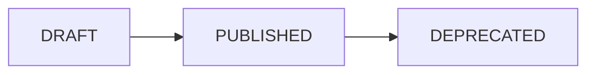

## Overview

WhatsApp Flows provide native UI components for building interactive experiences within WhatsApp. Use the Flows API to create, publish, and manage your flows.

## List Flows

Retrieve all flows.

```bash
GET /api/flows
```

### Query Parameters

| Parameter | Type | Description |
|-----------|------|-------------|
| `page` | integer | Page number (default: 1) |
| `limit` | integer | Items per page (default: 20) |
| `status` | string | Filter by status (DRAFT, PUBLISHED, DEPRECATED) |
| `account_id` | string | Filter by WhatsApp account |

### Response

```json
{
  "status": "success",
  "data": {
    "items": [
      {
        "id": "uuid",
        "meta_flow_id": "123456789",
        "name": "Order Form",
        "status": "PUBLISHED",
        "account_id": "uuid",
        "created_at": "2024-01-01T00:00:00Z"
      }
    ],
    "total": 10,
    "page": 1,
    "limit": 20
  }
}
```

## Get Flow

Retrieve a single flow with its JSON definition.

```bash
GET /api/flows/{id}
```

### Response

```json
{
  "status": "success",
  "data": {
    "id": "uuid",
    "meta_flow_id": "123456789",
    "name": "Order Form",
    "status": "PUBLISHED",
    "json_definition": {
      "version": "3.0",
      "screens": [
        {
          "id": "WELCOME",
          "title": "Welcome",
          "layout": {...}
        }
      ]
    },
    "created_at": "2024-01-01T00:00:00Z"
  }
}
```

## Create Flow

Create a new WhatsApp Flow.

```bash
POST /api/flows
```

### Request Body

```json
{
  "account_id": "uuid",
  "name": "Customer Survey",
  "categories": ["CUSTOMER_SUPPORT"],
  "json_definition": {
    "version": "3.0",
    "screens": [
      {
        "id": "SURVEY",
        "title": "Quick Survey",
        "layout": {
          "type": "SingleColumnLayout",
          "children": [
            {
              "type": "TextHeading",
              "text": "How was your experience?"
            },
            {
              "type": "RadioButtonsGroup",
              "name": "rating",
              "label": "Rating",
              "data-source": [
                {"id": "5", "title": "Excellent"},
                {"id": "4", "title": "Good"},
                {"id": "3", "title": "Average"},
                {"id": "2", "title": "Poor"},
                {"id": "1", "title": "Very Poor"}
              ]
            },
            {
              "type": "Footer",
              "label": "Submit",
              "on-click-action": {
                "name": "complete",
                "payload": {}
              }
            }
          ]
        }
      }
    ]
  }
}
```

### Response

```json
{
  "status": "success",
  "data": {
    "id": "uuid",
    "name": "Customer Survey",
    "status": "DRAFT",
    "created_at": "2024-01-01T00:00:00Z"
  }
}
```

## Update Flow

Update a flow's definition.

```bash
PUT /api/flows/{id}
```

### Request Body

```json
{
  "name": "Updated Survey",
  "json_definition": {...}
}
```

## Delete Flow

Delete a flow.

```bash
DELETE /api/flows/{id}
```

<Warning>
  Published flows cannot be deleted. Deprecate them first.
</Warning>

## Save to Meta

Push the flow definition to Meta's WhatsApp Business API.

```bash
POST /api/flows/{id}/save-to-meta
```

### Response

```json
{
  "status": "success",
  "data": {
    "meta_flow_id": "123456789",
    "validation_errors": []
  }
}
```

## Publish Flow

Publish a draft flow to make it available for use.

```bash
POST /api/flows/{id}/publish
```

### Response

```json
{
  "status": "success",
  "data": {
    "id": "uuid",
    "status": "PUBLISHED"
  }
}
```

## Deprecate Flow

Deprecate a published flow.

```bash
POST /api/flows/{id}/deprecate
```

### Response

```json
{
  "status": "success",
  "data": {
    "id": "uuid",
    "status": "DEPRECATED"
  }
}
```

## Sync Flows

Sync flows from Meta.

```bash
POST /api/flows/sync
```

### Request Body

```json
{
  "account_id": "uuid"
}
```

### Response

```json
{
  "status": "success",
  "data": {
    "synced": 5,
    "new": 1,
    "updated": 2
  }
}
```

## Flow Status Lifecycle



| Status | Description |
|--------|-------------|
| `DRAFT` | Flow is being designed, not yet available |
| `PUBLISHED` | Flow is live and can be sent to users |
| `DEPRECATED` | Flow has been retired |

<Note>
  Flows must pass Meta's validation before they can be published. Use the Save to Meta endpoint to check for validation errors.
</Note>
